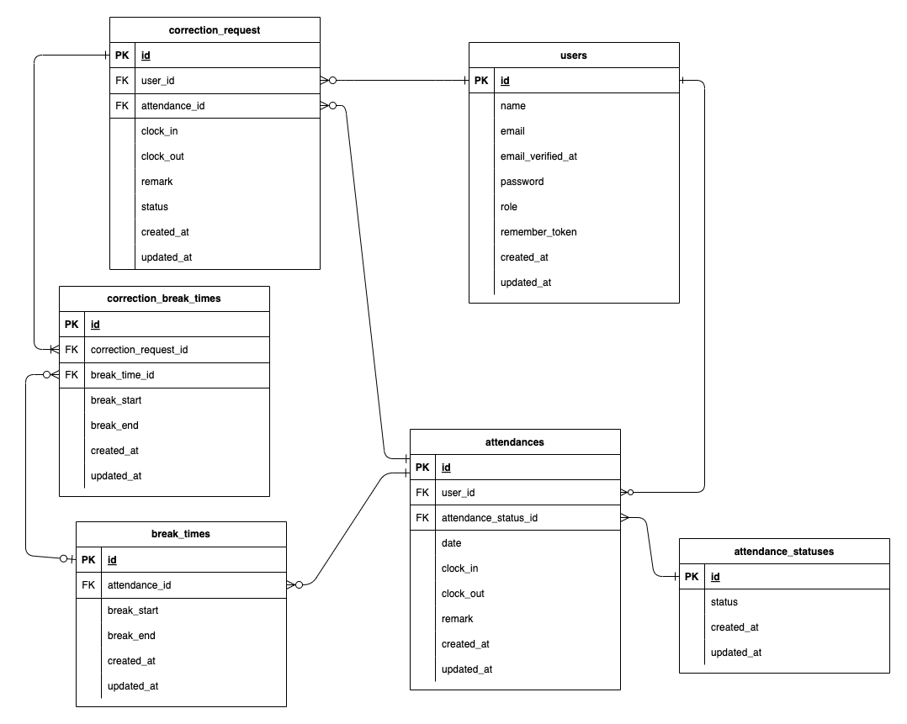

# 📝 勤怠管理アプリ
## 🛠 環境構築
### Dockerビルド
1. git clone git@github.com:ghshzk/attendance-management-app.git
2. docker-compose up -d --build

### Laravel環境構築
1. docker-compose exec php bash
2. composer install
3. cp .env.example .env
4. .envファイルの環境変数を変更
5. php artisan key:generate
6. php artisan migrate
7. php artisan db:seed

## 💻 使用技術
- Laravel 8
- PHP 7.4.9
- MySQL 8.0.26
- Nginx 1.21.1

## 📧 メール認証（Mailtrap）
メール認証機能に **Mailtrap** を使用しています。開発環境では以下の手順で設定を行ってください。
1. [Mailtrap](https://mailtrap.io/)に登録・ログイン、サイドバーの Inboxes から My Inbox を開く
2. Integrations で「**laravel 7.x and 8.x**」を選択し、`.env`ファイルの`MAIL`セクションにコピー&ペースト

```
.envファイルのメール設定例

MAIL_MAILER=smtp
MAIL_HOST=sandbox.smtp.mailtrap.io
MAIL_PORT=2525
MAIL_USERNAME=xxxxxxxxxxxxxx
MAIL_PASSWORD=xxxxxxxxxxxxxx
MAIL_ENCRYPTION=tls
MAIL_FROM_ADDRESS="test@example.com"   # 送信元メールアドレス（任意）
MAIL_FROM_NAME="${APP_NAME}"   # 送信元名（任意）
```

## 📅 日付の選択と遷移
### 月単位の表示切替
* **対象画面:** 勤怠一覧画面(一般ユーザー)、スタッフ別勤怠一覧画面(管理者)
* **操作方法:**
1. 現在の月が表示されている部分にある**カレンダーアイコン**をクリックします。
2. 月を選択するためのカレンダーが表示されるので、ここから特定の月を選択すると、その月の勤怠一覧へ表示が切り替わります。
3. また、現在の月の左右にある**矢印**をクリックすることで、1ヶ月単位で前後に表示を切り替えられます。

### 日単位の表示切替
* **対象画面:** 勤怠一覧画面(管理者)
* **操作方法:**
1. 日付が表示されている部分にある**カレンダーアイコン**をクリックします。
2. 日付を選択するためのカレンダーが表示されるので、ここから特定の日付を選択すると、その日の勤怠一覧へ表示が切り替わります。
3. また、日付の左右にある**矢印**をクリックすることで、1日単位で前後に表示を切り替えられます。


## 🗂 テーブル仕様
#### usersテーブル
| カラム名           | 型                | PRIMARY KEY | UNIQUE KEY | NOT NULL | FOREIGN KEY |
| :---------------- | :--------------- | :--------: | :--------: | :------: | :---------: |
| id                | BIGINT UNSIGNED  | ○          |            | ○        |       |
| name              | VARCHAR(255)     |            |            | ○        |       |
| email             | VARCHAR(255)     |            | ○          | ○        |       |
| email_verified_at | TIMESTAMP        |            |            |          |       |
| password          | VARCHAR(255)     |            |            | ○        |       |
| role              | ENUM(user,admin) |            |            | ○        |       |
| remember_token    | VARCHAR(100)     |            |            |          |       |
| created_at        | TIMESTAMP        |            |            |          |       |
| updated_at        | TIMESTAMP        |            |            |          |       |

#### attendance_statusesテーブル
| カラム名      | 型               | PRIMARY KEY | UNIQUE KEY | NOT NULL | FOREIGN KEY |
| :----------- | :--------------- | :--------: | :--------: | :------: | :---------: |
| id           | BIGINT UNSIGNED  | ○          |            | ○        |            |
| status       | VARCHAR(255)     |            |            | ○        |            |
| created_at   | TIMESTAMP        |            |            |          |            |
| updated_at   | TIMESTAMP        |            |            |          |            |

#### attendancesテーブル
| カラム名              | 型               | PRIMARY KEY | UNIQUE KEY | NOT NULL | FOREIGN KEY |
| :------------------- | :--------------- | :--------: | :--------: | :------: | :----------: |
| id                   | BIGINT UNSIGNED  | ○          |            | ○        |                         |
| user_id              | BIGINT UNSIGNED  |            |            | ○        | users(id)               |
| attendance_status_id | BIGINT UNSIGNED  |            |            | ○        | attendance_statuses(id) |
| date                 | DATE             |            |            | ○        |                         |
| clock_in             | TIME             |            |            |          |                         |
| clock_out            | TIME             |            |            |          |                         |
| remark               | VARCHAR(255)     |            |            |          |                         |
| created_at           | TIMESTAMP        |            |            |          |                         |
| updated_at           | TIMESTAMP        |            |            |          |                         |

#### break_timesテーブル
| カラム名       | 型               | PRIMARY KEY | UNIQUE KEY | NOT NULL | FOREIGN KEY |
| :------------ | :--------------- | :--------: | :--------: | :------: | :---------: |
| id            | BIGINT UNSIGNED  | ○          |            | ○        |                 |
| attendance_id | BIGINT UNSIGNED  |            |            | ○        | attendances(id) |
| break_start   | TIME             |            |            |          |                 |
| break_end     | TIME             |            |            |          |                 |
| created_at    | TIMESTAMP        |            |            |          |                 |
| updated_at    | TIMESTAMP        |            |            |          |                 |

#### correction_requestsテーブル
| カラム名       | 型                     | PRIMARY KEY | UNIQUE KEY | NOT NULL | FOREIGN KEY |
| :------------ | :--------------------- | :--------: | :--------: | :------: | :---------: |
| id            | BIGINT UNSIGNED        | ○          |            | ○        |                 |
| user_id       | BIGINT UNSIGNED        |            |            | ○        | users(id)       |
| attendance_id | BIGINT UNSIGNED        |            |            | ○        | attendances(id) |
| clock_in      | TIME                   |            |            |          |                 |
| clock_out     | TIME                   |            |            |          |                 |
| remark        | VARCHAR(255)           |            |            |          |                 |
| status        | ENUM(pending,approved) |            |            | ○        |                 |
| created_at    | TIMESTAMP              |            |            |          |                 |
| updated_at    | TIMESTAMP              |            |            |          |                 |

#### correction_break_timesテーブル
| カラム名               | 型               | PRIMARY KEY | UNIQUE KEY | NOT NULL | FOREIGN KEY |
| :-------------------- | :--------------- | :--------: | :--------: | :------: | :----------: |
| id                    | BIGINT UNSIGNED  | ○          |            | ○        |                         |
| correction_request_id | BIGINT UNSIGNED  |            |            | ○        | correction_requests(id) |
| break_time_id         | BIGINT UNSIGNED  |            |            |          | break_times(id)         |
| break_start           | TIME             |            |            |          |                         |
| break_end             | TIME             |            |            |          |                         |
| created_at            | TIMESTAMP        |            |            |          |                         |
| updated_at            | TIMESTAMP        |            |            |          |                         |

## 🗺 ER図


## 🔑 テストアカウントのログイン情報
### 管理者ユーザー
**name:** 管理者 ユーザー\
**email:** admin@example.com\
**password:** adminpass

### 一般ユーザー
**name:** 山田 太郎\
**email:** user1@example.com\
**password:** password

## 🌐 URL
- 開発環境: http://localhost/
- phpMyAdmin: http://localhost:8080/